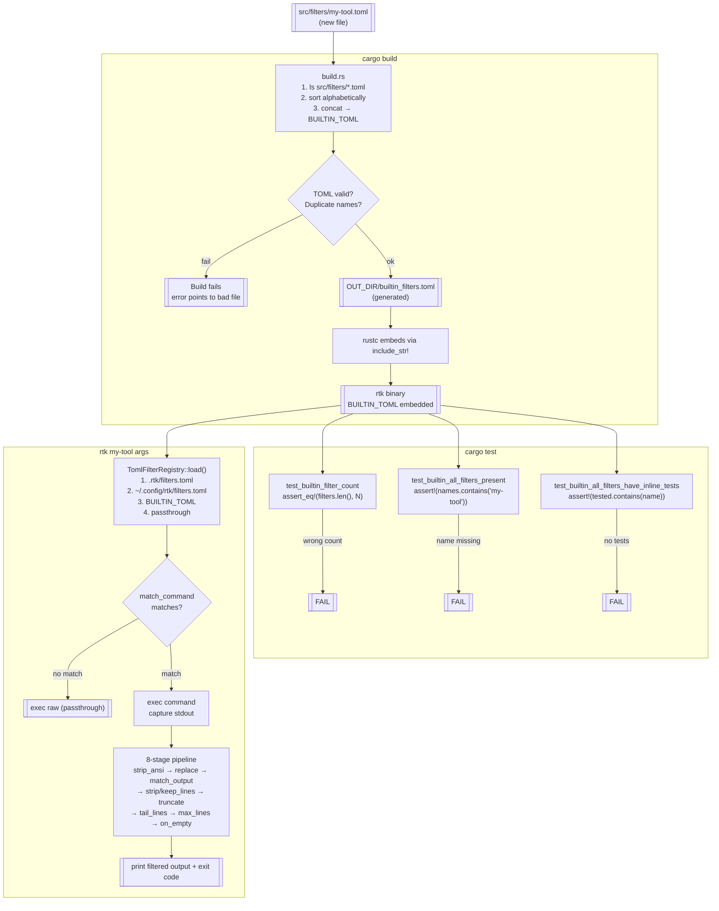
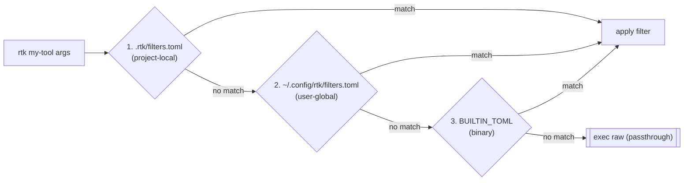

# Built-in Filters

> See also [docs/contributing/TECHNICAL.md](../../docs/contributing/TECHNICAL.md) for the full architecture overview

Each `.toml` file in this directory defines one filter and its inline tests.
Files are concatenated alphabetically by `build.rs` into a single TOML blob embedded in the binary.

## When to Use a TOML Filter

TOML filters strip noise lines — they don't reformat output. The filtered result must still look like real command output (see [Design Philosophy](../../CONTRIBUTING.md#design-philosophy)). For the full TOML-vs-Rust decision criteria, see [CONTRIBUTING.md](../../CONTRIBUTING.md#toml-vs-rust-which-one).

TOML works well for commands with **predictable, line-by-line text output** where regex filtering achieves 60%+ savings:
- Install/update logs (brew, composer, poetry) — strip `Using ...` / `Already installed` lines
- System monitoring (df, ps, systemctl) — keep essential rows, drop headers/decorations
- Simple linters (shellcheck, yamllint, hadolint) — strip context, keep findings
- Infra tools (terraform plan, helm, rsync) — strip progress, keep summary

For the full contribution checklist (including `discover/rules.rs` registration), see [src/cmds/README.md — Adding a New Command Filter](../cmds/README.md#adding-a-new-command-filter).

## Adding a filter

1. Copy any existing `.toml` file and rename it (e.g. `my-tool.toml`)
2. Update the three required fields: `description`, `match_command`, and at least one action field
3. Add `[[tests.my-tool]]` entries to verify the filter behaves correctly
4. Run `cargo test` — the build step validates TOML syntax and runs inline tests

## File format

```toml
[filters.my-tool]
description = "Short description of what this filter does"
match_command = "^my-tool\\b"          # regex matched against the full command string
strip_ansi = true                       # optional: strip ANSI escape codes first
strip_lines_matching = [               # optional: drop lines matching any of these regexes
  "^\\s*$",
  "^noise pattern",
]
max_lines = 40                          # optional: keep only the first N lines after filtering
on_empty = "my-tool: ok"               # optional: message to emit when output is empty after filtering

[[tests.my-tool]]
name = "descriptive test name"
input = "raw command output here"
expected = "expected filtered output"
```

## Available filter fields

| Field | Type | Description |
|-------|------|-------------|
| `description` | string | Human-readable description |
| `match_command` | regex | Matches the command string (e.g. `"^docker\\s+inspect"`) |
| `strip_ansi` | bool | Strip ANSI escape codes before processing |
| `filter_stderr` | bool | Capture and merge stderr into stdout before filtering (use for tools like liquibase that emit banners to stderr) |
| `strip_lines_matching` | regex[] | Drop lines matching any regex |
| `keep_lines_matching` | regex[] | Keep only lines matching at least one regex |
| `replace` | array | Regex substitutions (`{ pattern, replacement }`) |
| `match_output` | array | Short-circuit rules (`{ pattern, message }`) |
| `truncate_lines_at` | int | Truncate lines longer than N characters |
| `max_lines` | int | Keep only the first N lines |
| `tail_lines` | int | Keep only the last N lines (applied after other filters) |
| `on_empty` | string | Fallback message when filtered output is empty |

## Naming convention

Use the command name as the filename: `terraform-plan.toml`, `docker-inspect.toml`, `mix-compile.toml`.
For commands with subcommands, prefer `<cmd>-<subcommand>.toml` over grouping multiple filters in one file.

## Build and runtime pipeline

How a `.toml` file goes from contributor → binary → filtered output.



## Filter lookup priority



First match wins. A project filter with the same name as a built-in shadows the built-in and triggers a warning:

```
[rtk] warning: filter 'make' is shadowing a built-in filter
```
