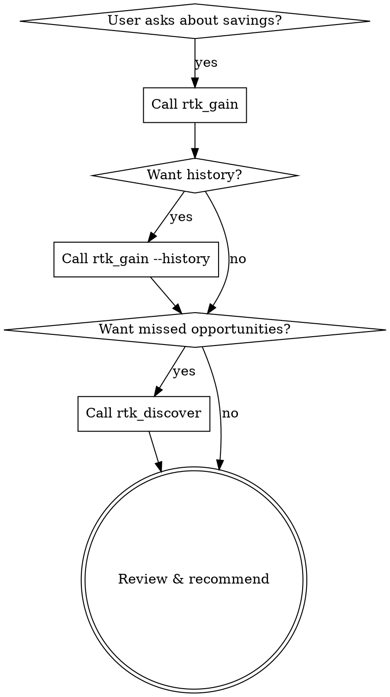

# RTK Gain & Discovery

## Overview

RTK tracks how much context window you save by compacting command output. Use this skill to report savings, discover missed opportunities, and recommend workflow improvements.

**Core principle:** Data-driven optimization — measure before recommending changes.

## When to Use

- User asks "how much has RTK saved?"
- User wants to know which commands could have used RTK
- User asks about improving command-output efficiency
- You want to proactively suggest RTK adoption after repeated native shell usage

## Workflow

1. **Current savings** → `rtk_gain` — shows aggregate token savings.
2. **Recent history** → `rtk_gain({args:["--history"]})` — shows per-command breakdown.
3. **Missed opportunities** → `rtk_discover` — finds commands that should have used RTK.
4. **Recommend changes** — only after reviewing discover output. Get user approval before modifying config or instructions.

## Quick Reference

| Goal | Tool | Example |
|------|------|---------|
| Total savings | `rtk_gain` | `rtk_gain()` |
| Per-command breakdown | `rtk_gain` | `rtk_gain({args:["--history"]})` |
| Day-by-day breakdown | `rtk_gain` | `rtk_gain({args:["--daily"]})` |
| Weekly aggregation | `rtk_gain` | `rtk_gain({args:["--weekly"]})` |
| ASCII graph (30 days) | `rtk_gain` | `rtk_gain({args:["--graph"]})` |
| JSON export | `rtk_gain` | `rtk_gain({args:["--all", "--format", "json"]})` |
| Missed RTK commands | `rtk_discover` | `rtk_discover()` |
| Missed (all projects, 7d) | `rtk_discover` | `rtk_discover({args:["--all", "--since", "7"]})` |
| Session adoption rate | — | Use `rtk_run({command:"rtk session"})` |

## Expected Savings by Category

| Category | Expected Savings | Examples |
|----------|-----------------|----------|
| Git operations | 70-92% | `git status`, `git push`, `git log` |
| Test runners | 90-99% | `cargo test`, `jest`, `pytest` |
| Build/Lint | 70-87% | `cargo build`, `tsc`, `eslint` |
| File operations | 50-95% | `ls`, `cat` → `rtk read`, `grep` |
| Package managers | 60-80% | `pnpm list`, `pip list` |
| Containers/Cloud | 60-80% | `docker ps`, `aws ec2` |

## Interpreting Results

**High savings (>80%):** RTK is well-adopted — focus on maintaining.

**Low savings (<50%):** Check:
1. Are commands running through RTK? Check `rtk_discover`.
2. Are there custom commands not supported? Consider TOML filters.
3. Is RTK properly configured? Check `rtk_verify`.

**Zero savings on some commands:** `rtk proxy <cmd>` runs with 0% savings (passthrough + tracking). This is expected.

## When to Proactively Suggest RTK

If you notice:
- Multiple `cat` calls on large files → Suggest `rtk read`
- Multiple raw `git` commands → Suggest routing through RTK
- Test commands with full output → Suggest `rtk test <cmd>` wrapper
- Repeated native shell commands for supported tools → Mention RTK alternative

## Common Mistakes

| Mistake | Fix |
|---------|-----|
| Recommending config changes without data | Always run `rtk_discover` first |
| Modifying instructions without user approval | Present findings, then ask before changing |
| Only checking savings without discover | Both tools together give the full picture |
| Ignoring `rtk session` for adoption tracking | Session shows per-session adoption rate |
| Not mentioning `rtk_gain --graph` for trends | ASCII graph reveals trends over time |
