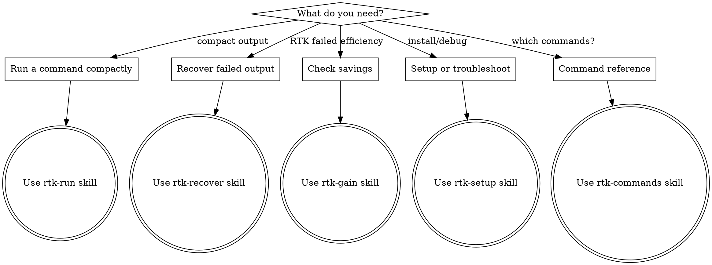

# RTK Guide

## Overview

RTK MCP provides desktop agents with compact command output. Unlike Claude Code shell hooks, desktop clients (Claude Desktop, Codex, Antigravity) do not auto-rewrite commands — agents must explicitly choose RTK tools based on instructions and tool descriptions.

RTK is a **high-performance CLI proxy** (single Rust binary, <10ms overhead) that reduces LLM token consumption by **60-90%** on 100+ commands across all major development ecosystems.

**Core principle:** Know which tool and skill to use for each RTK workflow.

## Tools

| Tool | Purpose | When |
|------|---------|------|
| `rtk_should_use` | Decide if a command should go through RTK | Uncertain about RTK support |
| `rtk_run` | Run non-interactive command with compact output | Command is RTK-supported |
| `rtk_read_log` | Read full-output tee logs after failed RTK runs | `rtk_run` returned a `teePath` |
| `rtk_gain` | Show token savings analytics | User asks about efficiency |
| `rtk_discover` | Find missed RTK opportunities from history | Optimizing workflow |
| `rtk_verify` | Check RTK binary and MCP setup | Install or troubleshoot |

## Skills

| Situation | Skill | Description |
|-----------|-------|-------------|
| Running commands with compact output | `rtk-run` | Decision flow for when and how to use `rtk_run` |
| Recovering detail from failed commands | `rtk-recover` | Tee log diagnosis workflow |
| Analyzing savings and missed opportunities | `rtk-gain` | Savings reports and workflow optimization |
| Installing or troubleshooting RTK | `rtk-setup` | Setup verification and client configuration |
| Full command reference and cheat sheet | `rtk-commands` | All 100+ commands organized by category |

## Supported Ecosystems (100+ Commands)

| Ecosystem | Commands | Typical Savings |
|-----------|----------|----------------|
| **Files** | `ls`, `read`, `find`, `grep`, `diff`, `smart`, `wc` | 50-95% |
| **Git** | `status`, `log`, `diff`, `show`, `add`, `commit`, `push`, `pull`, `branch`, `fetch`, `stash` | 70-92% |
| **GitHub CLI** | `pr list/view`, `issue list`, `run list` | 79-87% |
| **Rust** | `cargo test/build/check/clippy/install`, `cargo nextest` | 80-90% |
| **JavaScript/TypeScript** | `jest`, `vitest`, `tsc`, `eslint/biome`, `next build`, `prettier`, `prisma`, `playwright` | 70-99% |
| **Python** | `pytest`, `ruff`, `mypy`, `pip` | 60-90% |
| **Go** | `go test`, `golangci-lint` | 85-90% |
| **Ruby** | `rake test`, `rspec`, `rubocop`, `bundle` | 60-90% |
| **.NET** | `dotnet build/test` | 70-80% |
| **Containers** | `docker ps/images/logs`, `kubectl pods/logs/services` | 60-80% |
| **Cloud** | `aws sts/ec2/lambda/s3/logs/cloudformation/dynamodb/iam` | 60-80% |
| **Data/Analytics** | `json`, `deps`, `env`, `log`, `curl`, `wget`, `summary` | 50-80% |
| **Generic wrappers** | `rtk test <cmd>`, `rtk err <cmd>`, `rtk proxy <cmd>` | 80-90% |

## How It Works

```
Agent runs: git status
      ↓
MCP: rtk_should_use("git status")  →  { useRtk: true }
      ↓
MCP: rtk_run("git status")
      ↓
RTK binary executes:  rtk git status
      ↓
Raw output: 40 lines (~800 tokens)  →  Filtered: 3 lines (~60 tokens)
      ↓
Agent sees compact output (92% saved)
```

## Key Features

### Token Savings Analytics
```bash
rtk gain              # Summary of all savings
rtk gain --daily      # Day-by-day breakdown
rtk gain --graph      # ASCII chart (30 days)
rtk discover          # Find missed RTK opportunities
rtk session           # Adoption rate per session
```

### Configuration
Config file: `~/.config/rtk/config.toml`
```toml
[hooks]
exclude_commands = ["curl", "playwright"]
[tee]
enabled = true
mode = "failures"
[filters]
ignore_dirs = [".git", "node_modules", "target"]
```

### Custom TOML Filters
```toml
# ~/.config/rtk/filters/my-cmd.toml or <project>/.rtk/filters/my-cmd.toml
[filter]
command = "my-cmd"
strip_lines_matching = ["^Debug:", "^Verbose:"]
keep_lines_matching = ["^error", "^warning"]
max_lines = 50
```

### Global Flags
| Flag | Description |
|------|-------------|
| `-u` / `--ultra-compact` | Extra savings with ASCII icons |
| `-v` / `--verbose` | Show filter details on stderr |
| `--skip-env` | Set `SKIP_ENV_VALIDATION=1` |

### Environment Variables
| Variable | Description |
|----------|-------------|
| `RTK_DISABLED=1` | Disable RTK for one command |
| `RTK_TEE_DIR` | Override tee log directory |
| `RTK_TELEMETRY_DISABLED=1` | Disable telemetry |

## Decision Flow



## Windows Notes

- **Native Windows:** Filters work, but auto-rewrite hooks do NOT. Use `rtk <cmd>` explicitly.
- **WSL:** Full support — identical to Linux.
- **Antigravity setup:** `rtk init --agent antigravity` → prompt-level rules, no auto-rewrite.
