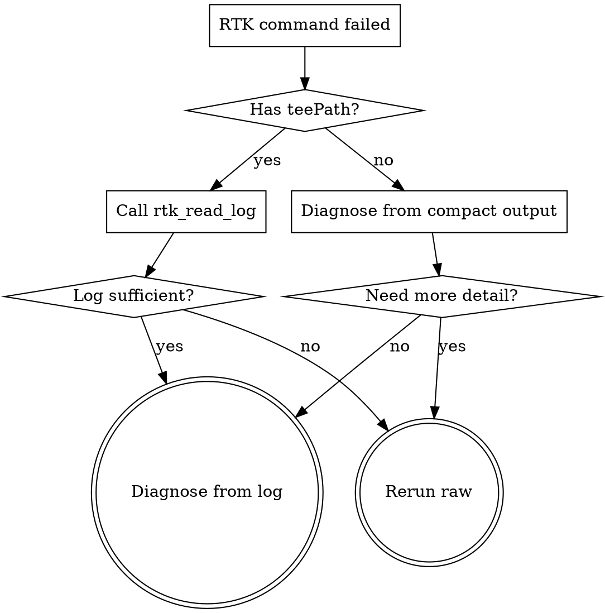

# RTK Recover

## Overview

When `rtk_run` fails, RTK may save the full raw output to a tee log under `~/.rtk-mcp/tee`. This skill guides you through recovering detail from that log before falling back to a raw native rerun.

**Core principle:** Always read the tee log before rerunning raw — it usually contains everything you need.

## When to Use

- `rtk_run` returned a failure with `teePath` in the output
- Compact output hides detail needed for diagnosis
- User asks to see the full/raw output of a previous command
- You need more context from a failed command

## Workflow



1. **Inspect compact failure output first** — it may contain enough information.
2. **Check for `teePath`** — if present, call `rtk_read_log({path: teePath})`.
3. **Diagnose from the raw log** — look for error messages, stack traces, exit codes.
4. **Rerun raw only when** the log is insufficient, stale, or missing.

## Tee System Details

RTK's tee system saves full raw output on command failure for later inspection:

| Setting | Default | Description |
|---------|---------|-------------|
| `tee.enabled` | `true` | Enable/disable tee recovery |
| `tee.mode` | `"failures"` | `"failures"` (default), `"always"`, or `"never"` |
| `tee.max_files` | `20` | Rotation: keep last N files |
| Min size | 500 bytes | Outputs shorter than this are not saved |
| Max file size | 1 MB | Truncated above this |

**Override tee directory:** Set `RTK_TEE_DIR` env var.

**Tee output format:**
```
FAILED: 2/15 tests
[full output: ~/.local/share/rtk/tee/1707753600_cargo_test.log]
```

The AI assistant (you) can then call `rtk_read_log` with the path to get full details without re-executing.

## Quick Reference

| Situation | Action |
|-----------|--------|
| `teePath` in failure output | `rtk_read_log({path: "..."})` |
| No `teePath`, compact output enough | Diagnose directly |
| No `teePath`, need more detail | Rerun with native shell |
| Log exists but is stale | Rerun with native shell |
| Tee disabled in config | Must rerun with native shell |
| Output too short (<500 bytes) | Not saved — diagnose from compact output |

## Configuration

Tee settings in `~/.config/rtk/config.toml`:

```toml
[tee]
enabled = true
mode = "failures"    # "failures", "always", "never"
max_files = 20
# directory = "/custom/tee/path"   # optional override
```

## Common Mistakes

| Mistake | Fix |
|---------|-----|
| Rerunning raw immediately without checking tee log | Always `rtk_read_log` first when `teePath` exists |
| Ignoring compact output and jumping to log | Read compact output first — it may suffice |
| Using `rtk_read_log` for arbitrary file reads | This tool ONLY reads files under `~/.rtk-mcp/tee` |
| Not checking if tee is enabled | If `tee.mode = "never"`, logs won't exist |
| Rerunning repeatedly without reading logs | Each rerun wastes tokens — read the log once instead |
