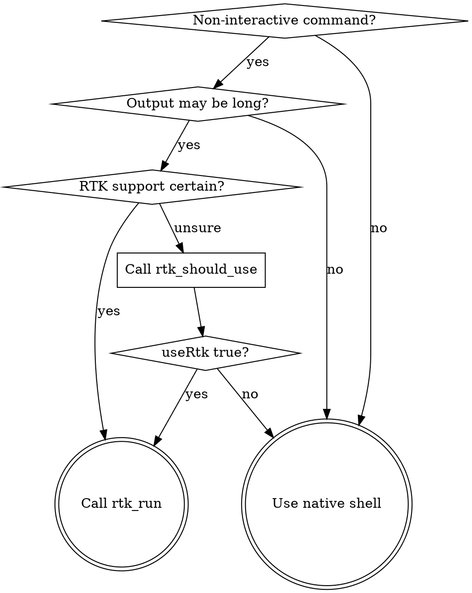

# RTK Run

## Overview

RTK compacts verbose command output into concise summaries, saving tokens and context window. Desktop MCP clients do not auto-rewrite commands — you must choose RTK explicitly.

**Core principle:** When a command may produce long output and is non-interactive, route it through RTK for compact results.

## When to Use

**Use RTK for (100+ commands):**
- **Files:** `ls`, `cat`/`head`/`tail` → `rtk read`, `find`, `grep`/`rg`, `diff`, `wc`
- **Git:** `git status`, `git log`, `git diff`, `git add`, `git commit`, `git push`, `git pull`, `git show`, `git branch`, `git fetch`, `git stash`
- **GitHub CLI:** `gh pr list`, `gh pr view`, `gh issue list`, `gh run list`
- **Tests:** `cargo test`, `jest`, `vitest`, `pytest`, `go test`, `playwright test`, `rake test`, `rspec`
- **Build/Lint:** `cargo build`/`check`/`clippy`, `tsc`, `eslint`/`biome`, `next build`, `prettier`, `ruff`, `mypy`, `golangci-lint`, `rubocop`, `dotnet build`
- **Package managers:** `pnpm list`, `pip list`/`outdated`, `bundle install`, `prisma generate`
- **Containers:** `docker ps`/`images`/`logs`, `kubectl pods`/`logs`/`services`
- **Cloud:** `aws sts`/`ec2`/`lambda`/`s3`/`logs`/`cloudformation`/`dynamodb`/`iam`
- **Data:** `curl`, `wget`, `json`, `env`, `log`, `deps`

**Do NOT use RTK for:**
- Interactive commands, dev servers, watch mode, REPLs
- Raw JSON or parser output intended for another program
- File mutation commands: `rm`, `mv`, `cp`, `chmod`, `touch`, `mkdir`
- Commands the user explicitly wants raw/unmodified

## Flag-Aware Behavior

RTK respects user intent. When users add verbose flags, RTK compresses less:

| Scenario | RTK Behavior |
|----------|--------------|
| `cargo test` (default) | Failures only (~90% savings) |
| `cargo test -- --nocapture` | Preserves all output (user asked for it) |
| `git log` (default) | Compact one-line commits (~80%) |
| `git log --oneline` | Already compact, minimal extra savings |

## Workflow

1. **Obviously supported?** → Call `rtk_run` with the original raw command directly.
2. **Unsure?** → Call `rtk_should_use({command})` first.
3. **`useRtk` is true** → Call `rtk_run` with the original raw command (NOT the rewritten string).
4. **`useRtk` is false** → Use the native shell/tool.
5. **Command fails?** → Check if output includes `teePath`. If yes, use `rtk-recover` skill.

## Quick Reference

| Scenario | Action |
|----------|--------|
| `npm test` | `rtk_run` directly |
| `git log -n 20` | `rtk_run` directly |
| `eslint .` | `rtk_run` directly |
| `cargo build` | `rtk_run` directly |
| `docker ps` | `rtk_run` directly |
| `aws ec2 describe-instances` | `rtk_run` directly |
| `cat large-file.ts` | `rtk_run` (uses `rtk read`) |
| `npm run dev` | Native shell (interactive) |
| `rm -rf dist` | Native shell (file mutation) |
| Unknown command | `rtk_should_use` first |

## Ultra-Compact Mode

For extra savings, pass `-u` flag: `rtk -u git log` (ASCII icons, inline format).

## Custom Filters

If RTK doesn't optimize a specific command well enough, users can create TOML filters:
- Global: `~/.config/rtk/filters/`
- Project: `<project>/.rtk/filters/`

## Common Mistakes

| Mistake | Fix |
|---------|-----|
| Passing rewritten command to `rtk_run` | Always pass the **original raw command** |
| Using RTK for dev servers | Dev servers are interactive — use native shell |
| Using RTK for `rm`, `mv`, `cp` | File mutations are blocked by security guard |
| Skipping `rtk_should_use` for unknown commands | When unsure, always check first |
| Rerunning raw immediately after RTK failure | Read tee log with `rtk_read_log` first |
| Using raw `cat` instead of `rtk read` | `rtk read` smart-filters code files |
| Not wrapping unknown test commands | `rtk test <cmd>` wraps any test runner |

## Red Flags

- About to run an interactive or long-lived command through RTK
- About to pass the rewritten command string instead of the original
- About to use native shell for a command that could benefit from compact output
- Ignoring `teePath` in failure output
- Running `cat` on large files instead of `rtk read`

**All of these mean: STOP and reconsider your approach.**
