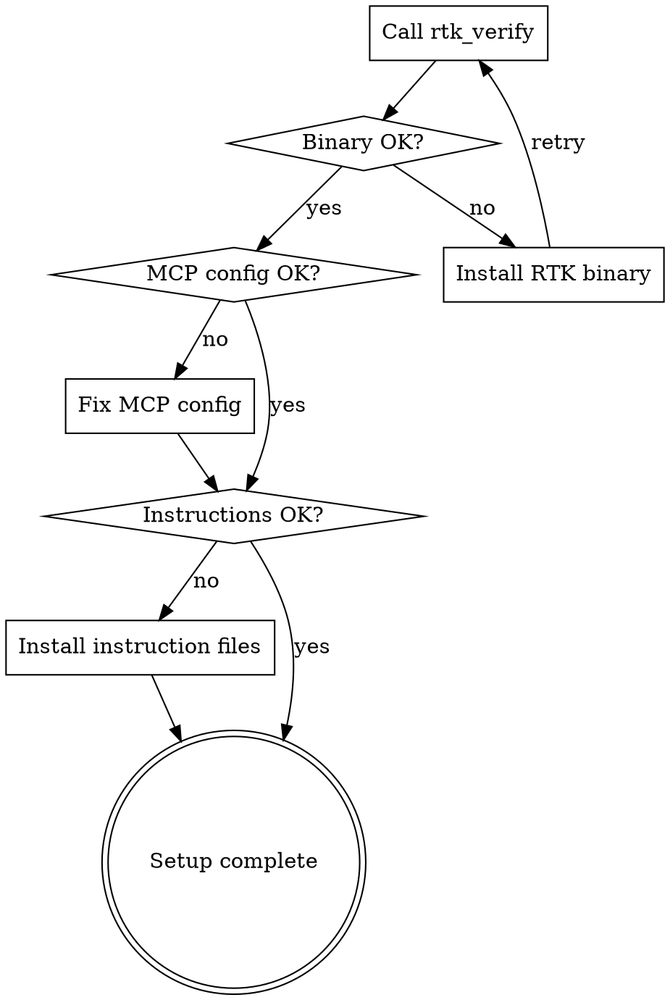

# RTK Setup

## Overview

RTK MCP requires a working RTK binary, correct MCP server configuration, and client-specific instruction files. This skill guides you through verifying and troubleshooting the setup.

**Core principle:** Verify before diagnosing — always run `rtk_verify` as the first step.

## When to Use

- First-time RTK installation
- RTK commands are not working
- MCP server connection issues
- Missing or incorrect client configuration
- User asks about RTK setup status
- Windows-specific setup questions

## Workflow



1. **Run `rtk_verify`** — checks binary availability and basic MCP readiness.
2. **Fix binary issues** — ensure RTK is installed and on PATH.
3. **Check MCP config** — verify the server entry in the client's config file.
4. **Check instruction files** — ensure rules and skills are installed for the target client.

## Installation Methods

| Method | Command | Platform |
|--------|---------|----------|
| Homebrew | `brew install rtk` | macOS/Linux |
| Quick install | `curl -fsSL https://raw.githubusercontent.com/rtk-ai/rtk/refs/heads/master/install.sh \| sh` | macOS/Linux |
| Cargo | `cargo install --git https://github.com/rtk-ai/rtk` | Any |
| Pre-built binary | Download from [releases](https://github.com/rtk-ai/rtk/releases) | Any |
| WSL | Use any Linux method inside WSL | Windows |

### Verification

```bash
rtk --version    # Should show "rtk 0.28.2" or newer
rtk gain         # Should show token savings stats
```

> **Name collision warning:** Another "rtk" (Rust Type Kit) exists on crates.io. If `rtk gain` fails, you have the wrong package. Use `cargo install --git` instead.

## Agent-Specific Setup

| Agent | Init Command | Method |
|-------|-------------|--------|
| Claude Desktop | MCP config: `claude_desktop_config.json` | JSON mcpServers entry |
| Codex Desktop | MCP config: `~/.codex/config.toml` | TOML mcp_servers entry |
| **Antigravity** | `rtk init --agent antigravity` | `.agents/rules/` |

## Windows Support

| Feature | WSL | Native Windows |
|---------|-----|----------------|
| Filters (cargo, git, etc.) | Full | Full |
| Auto-rewrite hook | Yes | No (CLAUDE.md fallback) |
| `rtk init -g` | Hook mode | CLAUDE.md/rules mode |
| `rtk gain` / analytics | Full | Full |

**Recommendation:** Use WSL for the best experience. Inside WSL, RTK works identically to Linux.

**Native Windows users:** Do NOT double-click `rtk.exe` — it's a CLI tool. Always run from PowerShell or Command Prompt.

## Override: Disable RTK Temporarily

```bash
RTK_DISABLED=1 git status    # Runs raw git status, no rewrite
```

Or exclude permanently in config:
```toml
[hooks]
exclude_commands = ["git rebase", "git cherry-pick"]
```

## Client Configuration Reference

| Client | MCP Config Location | Instruction Files |
|--------|--------------------|-------------------|
| Claude Desktop (Windows) | `%APPDATA%\Claude\claude_desktop_config.json` | `~/.claude/CLAUDE.md`, `~/.claude/skills/` |
| Claude Desktop (macOS) | `~/Library/Application Support/Claude/claude_desktop_config.json` | `~/.claude/CLAUDE.md`, `~/.claude/skills/` |
| Claude Desktop (Linux) | `~/.config/Claude/claude_desktop_config.json` | `~/.claude/CLAUDE.md`, `~/.claude/skills/` |
| Codex Desktop | `~/.codex/config.toml` | `~/.codex/AGENTS.md`, `~/.codex/skills/` |
| Antigravity | `~/.gemini/antigravity/mcp_config.json` | `~/.gemini/GEMINI.md`, `~/.gemini/antigravity/skills/` |

## RTK Configuration

Config file locations:
- Linux: `~/.config/rtk/config.toml`
- macOS: `~/Library/Application Support/rtk/config.toml`

```bash
rtk config            # Show current configuration
rtk config --create   # Create config file with defaults
```

Key sections:

```toml
[tracking]
enabled = true
history_days = 90

[display]
colors = true
emoji = true
max_width = 120

[filters]
ignore_dirs = [".git", "node_modules", "target", "__pycache__"]
ignore_files = ["*.lock", "*.min.js"]

[tee]
enabled = true
mode = "failures"    # "failures", "always", "never"
max_files = 20

[hooks]
exclude_commands = []
```

## Common Mistakes

| Mistake | Fix |
|---------|-----|
| Skipping `rtk_verify` and jumping to manual fixes | Always verify first — it catches most issues |
| Wrong config file path for the OS/client | Use the reference table above |
| Missing instruction files after MCP setup | MCP config alone is not enough — skills and rules are also needed |
| Editing the wrong config file when multiple clients are installed | Ask the user which client they are using |
| Installing wrong "rtk" package from crates.io | Use `cargo install --git https://github.com/rtk-ai/rtk` |
| Not restarting AI tool after setup | Hook changes require restart |

## Troubleshooting

| Symptom | Likely Cause | Fix |
|---------|-------------|-----|
| `rtk_verify` fails | RTK binary not installed or not on PATH | Install RTK, check `PATH` |
| MCP tools not available | Missing server entry in config | Add RTK MCP server to client config |
| RTK tools available but not used | Missing instruction files | Install `RTK.md` and skills |
| Commands fail with security error | Blocked command type (mutation, shell chain) | Use native shell for that command |
| `rtk gain` says "command not found" | Wrong "rtk" package installed | Uninstall, reinstall from `rtk-ai/rtk` |
| Hook not intercepting on Windows | Native Windows doesn't support hooks | Use WSL or explicit `rtk <cmd>` calls |

## Environment Variables

| Variable | Description |
|----------|-------------|
| `RTK_DISABLED=1` | Disable RTK for a single command |
| `RTK_TEE_DIR` | Override the tee directory |
| `RTK_TELEMETRY_DISABLED=1` | Disable telemetry |
| `RTK_HOOK_AUDIT=1` | Enable hook audit logging |
| `SKIP_ENV_VALIDATION=1` | Skip env validation (useful with Next.js) |
